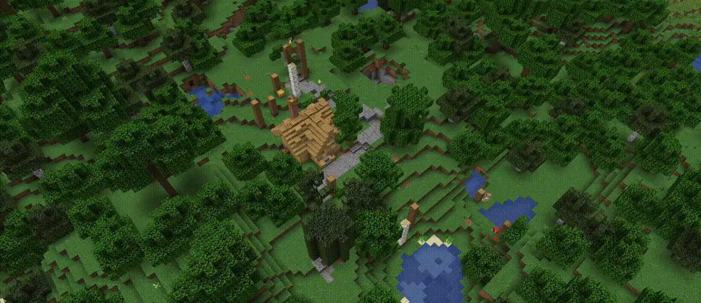

# AgentCraft
An adaptive settlement creation using a social agent simulation in Minecraft! This is my entry for the [2021 Generative Design in Minecraft](https://gendesignmc.wikidot.com/wiki:settlement-generation-competition) competition (including the Chronicle Challenge)!



## How to Run
Tested on Minecraft 1.16.5, Python 3.9

### Install Dependencies
Install the following packages with pip:
```
bitarray numpy names nbt requests scipy wonderwords
```

### Install Forge
Download and install Minecraft Forge for 1.16.5 [here](https://files.minecraftforge.net/).  

You need to own a copy of Minecraft (Java Version) and have it installed on your machine.

Get the [Forge Mod Launcher](https://files.minecraftforge.net/net/minecraftforge/forge/) (Download Recommended -> Installer) and install it (client install, but server should work, too). The latest version I tested is 1.16.5-36.1.0, but newer versions should work, too.

Open your Minecraft Launcher, the Forge Installation should have appeared there.

Open your mod folder. To do this open the Forge Installation you just installed and click the "Mods" button and then the "Open mods folder" button (You can skip this step by just navigating to %APPDATA%/.minecraft/mods).

Move .jar file from this repository into the mod folder.

Restart Minecraft and launch the Forge Installation again. The mod should now appear in the mod list under "Mods".

When you open a world the HTTP Server will be started automatically, and you should now be able to send HTTP requests to it.

## Usage
```
Options:
     -a X1,Y1,X2,Y2   |  Set the generator's build AREA in the running Minecraft world. Avoid spaces in between numbers.
     -t SECONDS       |  Set the TIME limit for the generator's execution. 
     -s STEPS         |  Set the number of TIME-STEPS the generator takes. 
     -f FRAMELENGTH   |  Set the duration of each frame of render.  seconds
     --norender       |  Disable per-frame rendering (for performance) 
     --nochronicle    |  Disable writing to chronicle
     --printchronicle |  Write the chronicle's output to console
     --leavesign      |  Render a sign at the center of the given area describing the location of the settlement.

Example:
     python3 run.py -a 0,0,200,200 -t 590 -s 2000 -f 0.4 --leavesign
 ```

## Credits
This project would not have been possible without:   
+ [Nils Gawlik](https://github.com/nilsgawlik) for their [http server](https://github.com/nilsgawlik/gdmc_http_interface), which let's me communicate with a running Minecraft process!
+ [Nevas Buildings](https://www.youtube.com/c/NevasBuildings/videos) for their permission to use and edit their beautiful buildings!
+ Asiiah Song for their [TownSim generator](https://github.com/AugmentedDesignLab/town-sim-py), whose code I borrowed and warped!
+ [Max Kreminski](https://github.com/mkremins) for their advice!
+ [Blinkenlights](https://github.com/Flashing-Blinkenlights) for their optimization help!
+ Troy, Ryan, & Trent for their pathfinding code in their 2020 [entry](https://gendesignmc.wikidot.com/wiki:2020-settlement-generation-competition)!